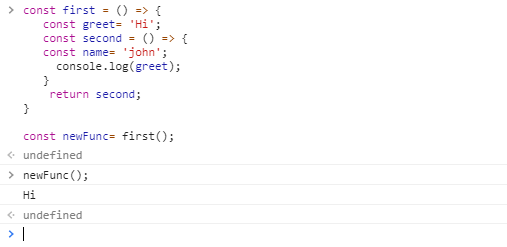
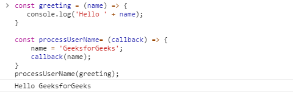
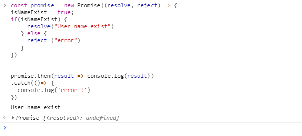

<div align="center">
  
  <h1>JavaScript Interview Questions</h1>

> Click :star: if you like the project. Pull Request are highly appreciated. Follow me [@iamkoushik1999](https://twitter.com/iamkoushik1999) for technical updates.

</div>

### Table of Contents

| No. | Questions                                                                                                                             |
| --- | ------------------------------------------------------------------------------------------------------------------------------------- |
| 1.  | [What are the different data types present in javascript ?](#what-are-the-different-data-types-present-in-javascript)                 |
| 2.  | [What is the difference between Undefined & Null ?](#what-is-the-difference-between-undefined--null)                                  |
| 3.  | [Difference between “ == “ and “ === “ operators.](#difference-between----and----operators)                                           |
| 4.  | [Difference between var and let and const keyword in javascript.](#difference-between-var-and-let-and-const-keyword-in-javascript)    |
| 5.  | [What is the NaN property in JavaScript?](#what-is-the-nan-property-in-javascript)                                                    |
| 6.  | [Explain “this” keyword.](#explain-this-keyword)                                                                                      |
| 7.  | [Explain Hoisting in javascript.](#explain-hoisting-in-javascript)                                                                    |
| 8.  | [Explain Closures in JavaScript.](#explain-closures-in-javascript)                                                                    |
| 9.  | [What is callback?](#what-is-callback)                                                                                                |
| 10. | [Explain Promise in Javascript.](#explain-promise-in-javascript)                                                                      |
| 11. | [Explain Async & Await in Javascript.](#explain-async--await-in-javascript)                                                           |
| 12. | [What is recursion in a programming language?](#what-is-recursion-in-a-programming-language)                                          |
| 13. | [What is DOM?](#what-is-dom)                                                                                                          |
| 14. | [What are arrow function?](#what-are-arrow-function)                                                                                  |
| 15. | [Differences between declaring variables using var, let and const.](#differences-between-declaring-variables-using-var-let-and-const) |
| 16. | [What is an Array?](#what-is-an-array)                                                                                                |
| 17. | [How to write Functions in JavaScript?](#how-to-write-functions-in-javascript)                                                        |
| 18. | []()                                                                                                                                  |

**[⬆ Back to Top](#table-of-contents)**

1. ### What are the different data types present in javascript ?
   **Primitive types**
   1. String
   2. Number
   3. Big Int
   4. Boolean
   5. Undefined
   6. Null
   7. Symbol

**[⬆ Back to Top](#table-of-contents)**

2. ### What is the difference between Undefined & Null?

| Undefined                                                                      | NULL                                                      |
| ------------------------------------------------------------------------------ | --------------------------------------------------------- |
| The undefined property indicates that a variable has not been declared at all. | The value null represents the absence of any object value |

Undefined Example

```javascript
var demo;
alert(demo); //shows undefined
alert(type of demo); //shows undefined
```

NULL Example

```javascript
var demo = null;
alert(demo); //shows null
alert(typeof demo); //shows object
```

**[⬆ Back to Top](#table-of-contents)**

3. ### Difference between “ == “ and “ === “ operators.

| ==                                                                                                   | ===                                                                                             |
| ---------------------------------------------------------------------------------------------------- | ----------------------------------------------------------------------------------------------- |
| returns true if operands have the same data type and same value, returns false if the values differ. | returns true only if operands are of the same data type and same value, otherwise returns false |
| Also known as loose equality                                                                         | Also known as strict equality                                                                   |

== Example

```javascript
var x = 2;
x == y; // Returns true since the value of both x and y is the same
```

=== Example

```javascript
var y = "2";
x === y; // Returns false since the typeof x is "number" and typeof y is "string"
```

**[⬆ Back to Top](#table-of-contents)**

4. ### Difference between var and let and const keyword in javascript.

| var                                                                            | let                                                                            | const                                                                                          |
| ------------------------------------------------------------------------------ | ------------------------------------------------------------------------------ | ---------------------------------------------------------------------------------------------- |
| The scope of a var variable is functional scope.                               | The scope of a let variable is block scope.                                    | The scope of a const variable is block scope.                                                  |
| It can be updated and re-declared into the scope.                              | It can be updated but cannot be re-declared into the scope.                    | It cannot be updated or re-declared into the scope.                                            |
| It can be declared without initialisation.                                     | It can be declared without initialisation.                                     | It cannot be declared without initialisation.                                                  |
| It can be accessed without initialization as its default value is “undefined”. | It can be accessed without initialization as its default value is “undefined”. | It cannot be accessed without initialisation, as it cannot be declared without initialisation. |

**[⬆ Back to Top](#table-of-contents)**

5. ### What is the NaN property in JavaScript?

> NaN property represents the “Not-a-Number” value. It indicates a value that is not a legal number.

```javascript
isNaN("Hello"); // Returns true
isNaN(345); // Returns false
isNaN("1"); // Returns false, since '1' is converted to Number type which results in 0 ( a number)
isNaN(undefined); // Returns true
```

**[⬆ Back to Top](#table-of-contents)**

6. ### Explain “this” keyword.

> The “this” keyword refers to the object that the function is a property of. The value of the “this” keyword will always depend on the object that is invoking the function.

```javascript
var obj = {
  name: "Vivek",
  getName: function () {
    console.log(this.name);
  },
};
obj.getName();
```

**[⬆ Back to Top](#table-of-contents)**

7. ### Explain Hoisting in javascript.

> JavaScript Hoisting refers to the process whereby the interpreter appears to move the declaration of functions, variables or classes to the top of their scope, before execution of the code.

> Hoisting allows functions to be safely used in code before they are declared.

Without Hoisting

```javascript
function catName(name) {
  console.log(`My cat's name is ${name}`);
}

catName("Tiger");
/*
The result of the code above is the same: "My cat's name is Tiger"
*/
```

With Hoisting

```javascript
catName("Tiger");

function catName(name) {
  console.log(`My cat's name is ${name}`);
}
/*
The result of the code above is: "My cat's name is Tiger"
*/
```

**[⬆ Back to Top](#table-of-contents)**

8. ### Explain Closures in JavaScript.

> A closure is simply a function inside another function with access to the outer function variable.

> In other words, closure is created when a child function keeps the environment of the parent scope even after the parent function has already been executed



**[⬆ Back to Top](#table-of-contents)**

9. ### What is callback?

> In javascript, a callback is simply a function that is passed to another function as a parameter and is invoked or executed inside the other function.



**[⬆ Back to Top](#table-of-contents)**

10. ### Explain Promise in Javascript.

> We understand the concept of callback but what will happen if your code will have callbacks within callbacks within callbacks and it goes on. Well, this recursive structure of callback is called ‘callback hell’ and promises to help to solve this kind of issue. Promises are useful in asynchronous javascript operations when we need to execute two or more back-to-back operations (or chaining callback), where each subsequent function starts when the previous one is completed. A promise is an object that may produce a single value sometime in the future, either a resolved value or a reason that it’s not resolved (rejected)

A promise may be in three possible states…

- Fulfilled: When the operation is completed successfully.
- Rejected: When the operation failed.
- Pending: initial state, neither fulfilled nor rejected.

We can consume any promise by attaching then() and catch() methods to the consumer.

- then() method is used to access the result when the promise is fulfilled.
- catch() method is used to access the result/error when the promise is rejected. In the code below, we are consuming the promise:



**[⬆ Back to Top](#table-of-contents)**

11. ### Explain Async & Await in Javascript.

> Stop and wait until something is resolved. Async & await just syntactic sugar on top of Promises and like promises it also provides a way to maintain asynchronous operation more synchronously. So in javascript asynchronous operations can be handled in various versions…

- ES5 -> Callback
- ES6 -> Promise
- ES7 -> async & await

> You can use Async/Await to perform the Rest API request where you want the data to fully load before pushing it to the view. For Nodejs and browser programmers async/await is a great syntactic improvement. It helps the developer to implement functional programming in javascript and it also increases the code readability.

**[⬆ Back to Top](#table-of-contents)**

12. ### What is recursion in a programming language?

> Recursion is a technique to iterate over an operation by having a function call itself repeatedly until it arrives at a result.

**[⬆ Back to Top](#table-of-contents)**

13. ### What is DOM?

- DOM stands for Document Object Model. DOM is a programming interface for HTML and XML documents.
- When the browser tries to render an HTML document, it creates an object based on the HTML document called DOM. Using this DOM, we can manipulate or change various elements inside the HTML document.

**[⬆ Back to Top](#table-of-contents)**

14. ### What are arrow function?

```javascript
let myFunction = (a, b) => a * b;
```

**[⬆ Back to Top](#table-of-contents)**

15. ### Differences between declaring variables using var, let and const.

| Keyword           | const | let | var |
| ----------------- | ----- | --- | --- |
| global scope      | no    | no  | yes |
| function scope    | yes   | yes | yes |
| block             | yes   | yes | no  |
| can be reassigned | no    | yes | yes |

**[⬆ Back to Top](#table-of-contents)**

16. ### What is an Array?

> An array is a collection of the same data type elements

**[⬆ Back to Top](#table-of-contents)**

17. ### How to write Functions in JavaScript?

> There are 4 ways to write Functions in JavaScript

```javascript
// Function Declaration
function square(x) {
  return x * x;
}

// Function Expression
const square = function(x) {
  return x * x;
}

// Arrow Function Expression
function square =(x)=> {
  return x * x;
}

// Concise Arrow Function Expression
function square = x => x * x;

```
